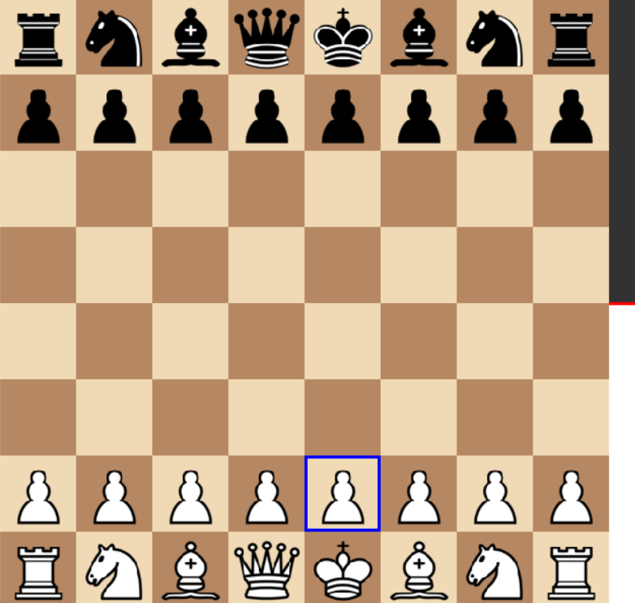
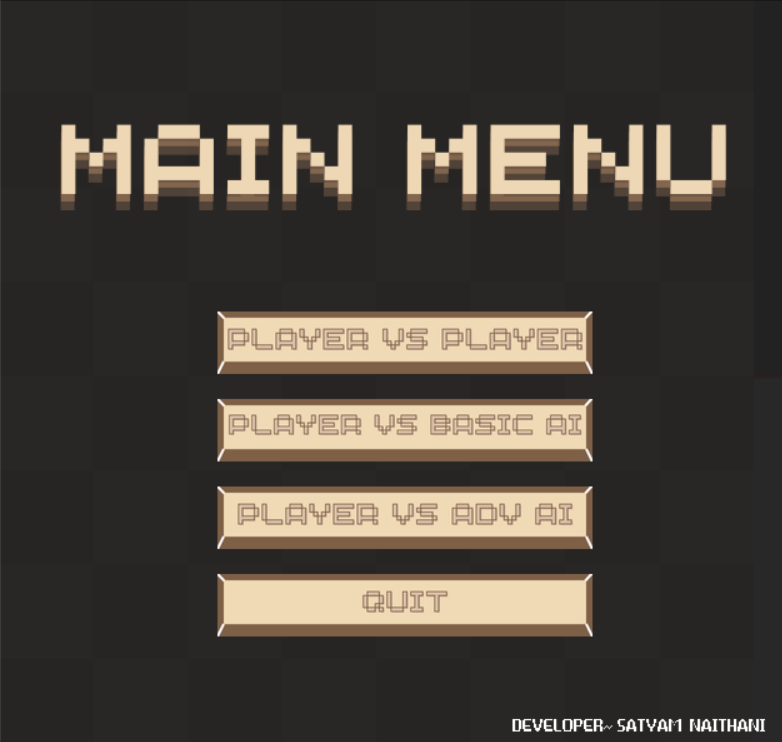
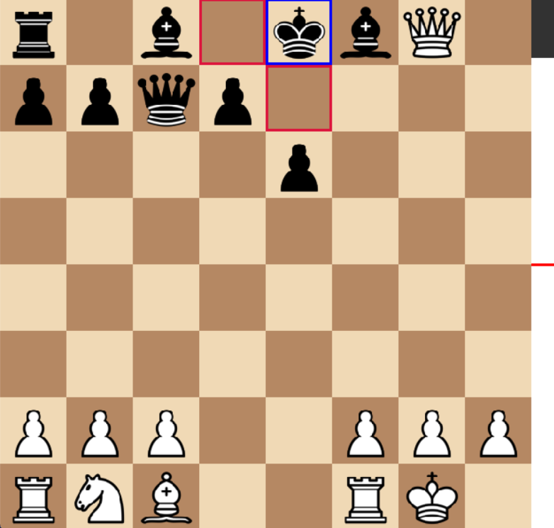
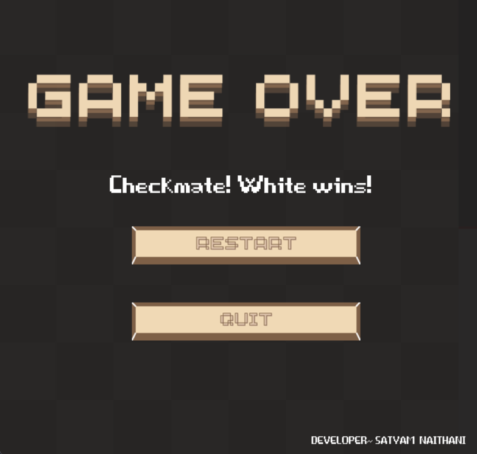
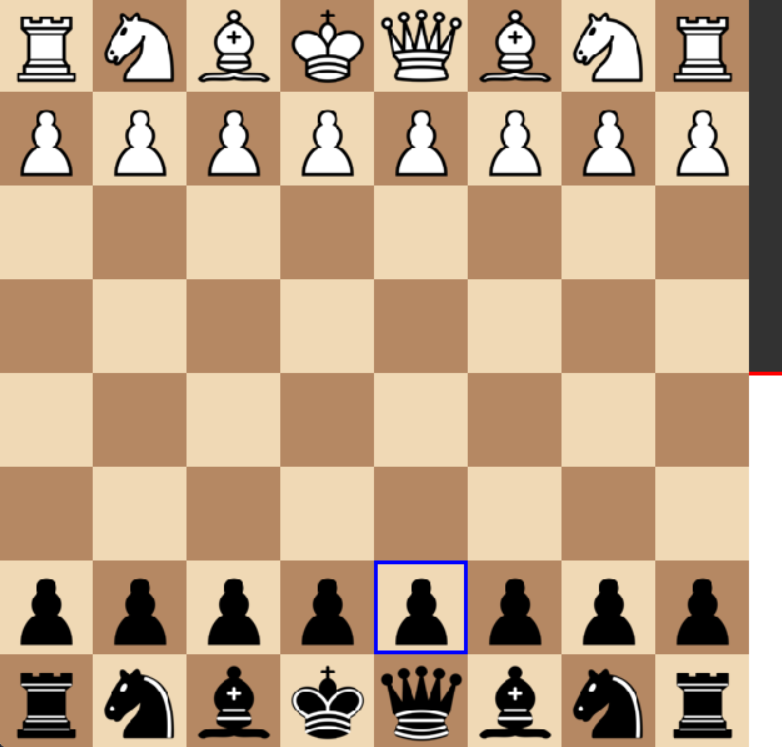

# Chess Bot

A Python-based chess bot project built using the `python-chess` library. The project features two chess engines (`basicEngine` and `advanceEngine`), both powered by Minimax algorithm with Alpha-Beta pruning, and integrates Stockfish for the advanced engine. The game also includes a user-friendly interface with multiple game modes and additional features.


## Features


### **Two Chess Engines**:
- **basicEngine**: A simple AI engine that uses its own evaluation function, powered by the Minimax algorithm with Alpha-Beta pruning.
- **advanceEngine**: A more powerful AI engine that uses the Stockfish evaluation function, combined with Alpha-Beta pruning for optimal performance.


### **Game Modes**:
- **Player vs Player**: Two players can compete against each other.
- **Player vs Basic Engine**: One player can play against the basicEngine.
- **Player vs Advance Engine**: One player can play against the advanceEngine, which uses Stockfish for move evaluation.

### **User Interface**:
- **Home Screen**: A welcoming screen with options to start a new game in any of the available modes.


- **Evaluation Bar**: An in-game bar that shows the evaluation of the current position, indicating whether the position favors white or black.

- **Game Over Screen**: Displays the result of the game, whether it is a win, loss, or draw.


### **AI Decision Making**:
- **Minimax with Alpha-Beta Pruning**: Both engines use the Minimax algorithm, optimized with Alpha-Beta pruning, to evaluate moves.
- **Stockfish Integration**: The advanceEngine uses the Stockfish engine for a deeper evaluation of board positions and better decision-making.

### **Move Evaluation**:
- **Piece-Square Tables**: Each piece has a table that evaluates its position on the board to make more intelligent decisions.
- **King Safety and Pawn Structure**: The AI evaluates the safety of the king and the structure of pawns to avoid weaknesses.
- **Material Evaluation**: The AI assesses the material balance on the board and strives for an advantage.

## How It Works

1. **Board Representation**: The chessboard is represented as an 8x8 grid, with pieces denoted by their respective abbreviations (e.g., 'bR' for black rook, 'wp' for white pawn).
2. **Evaluation Function**:
   - **basicEngine** uses a custom evaluation function that considers piece values, piece-square tables, king safety, and pawn structure.
   - **advanceEngine** uses Stockfish, a powerful open-source chess engine, for evaluation.
3. **AI Decision-Making**: 
   - The AI evaluates all possible moves using the Minimax algorithm.
   - Alpha-Beta pruning is applied to speed up the decision-making process by eliminating less promising branches.
4. **Piece-Square Tables**: Different values are assigned to pieces based on their position on the board. Each piece (pawn, knight, bishop, rook, queen, king) has its own evaluation table.
5. **Depth Control**: The AI's decision-making depth adjusts depending on the number of remaining pieces, ensuring faster decisions in endgame situations.

## Installation

To run this project, you need Python installed on your machine. Additionally, you need to install the required libraries.

### Requirements

- Python 3.x
- `python-chess` library
- `numpy` library
- Stockfish engine (for advanceEngine)

### Steps to Install

1. Clone the repository:
   ```bash
   git clone https://github.com/ReaalSATYAM/Chess-Bot.git
   ```
2. Install the required libraries:
    ```bash
    pip install python-chess numpy
    ```
3. Run the game:
    ```bash
    python ChessMain.py
    ```
## Usage
To run the chess bot, simply execute the main Python script. You can choose to play against the bot in one of the following modes:

1. Player vs Player  
2. Player vs Bot (basicEngine)
3. Player vs Bot (advanceEngine)

## Example Usage:
1. Run the main Python file to start the game.
2. Choose a game mode from the home screen.
3. Play your moves, and watch as the AI evaluates and responds based on the chosen engine.

## Hotkeys
- **Press Space:** To change player.
 
## Acknowledgements

This project uses **Stockfish**, a powerful open-source chess engine, for the advanced chess bot (`advanceEngine`). The Stockfish engine is licensed under the GPLv3 license.

- Stockfish GitHub: [https://github.com/official-stockfish/Stockfish](https://github.com/official-stockfish/Stockfish)
- License: [GPLv3 License](https://www.gnu.org/licenses/gpl-3.0.html)


## Contributing
Feel free to fork this repository, submit issues, or contribute pull requests. All contributions are welcome!

# Contact Information
[](mailto:satyamnaithani14@gmail.com)
[](https://www.linkedin.com/in/satyam-naithani-243076298/)
[](https://github.com/ReaalSATYAM)